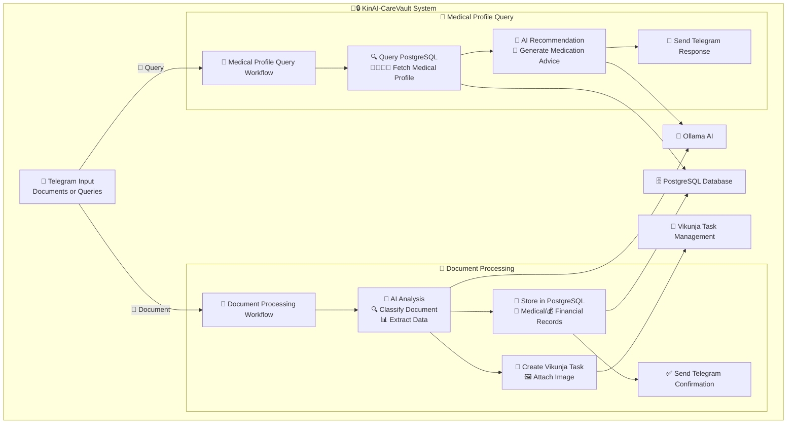

<div align="center">

# 🏥🔒 KinAI-CareVault - Health & Financial Vault  
*Intelligent Family Health & Financial Document Management*

**[ 🤖 AI-POWERED ] • [ 📄 DOCUMENT PROCESSING ] • [ 🔒 PRIVACY-FIRST ]**


<br/>


<br/>

<strong>🧠 Ollama • 📋 Vikunja • 🔄 Automation • 🐳 Docker</strong>

---

*Your family's intelligent health and financial assistant – secure, local, and always available*

</div>


KinAI-CareVault is an automated AI-powered system for processing medical and financial documents via Telegram, managing comprehensive family health profiles, and providing safe medication recommendations. It leverages PostgreSQL for structured storage, n8n workflows for automation, and AI (via Ollama) for intelligent document analysis and personalized medical advice.

<!-- Row 1: Identify the Challenge -->
<table style="width: 100%; border-collapse: collapse; font-family: sans-serif;">
  <tr>
    <td style="width: 200px; text-align: center; vertical-align: top; padding: 40px;">
      
    </td>
    <td style="padding: 40px; vertical-align: top;">
      <h2 style="color: #dc2626; display: flex; align-items: center; gap: 10px; margin-top: 0;">
        <span style="font-size: 24px;">🔍</span> 1. Identify the Challenge
      </h2>
      <p>
        Families juggle important health and financial records across scattered platforms—PDFs in email, prescriptions in chat, bills in drawers. This leads to:
      </p>
      <ul>
        <li>❌ Missed or incorrect medications</li>
        <li>❌ Disorganized or lost medical bills</li>
        <li>❌ No unified view across the family</li>
        <li>❌ Cloud-based solutions that risk privacy</li>
      </ul>
    </td>
  </tr>
</table>

<!-- Think Like a Human Agent -->
<table width="100%" border="0">
  <tr>
    <td width="15%" valign="top">
      
    </td>
    <td width="70%" valign="top">
      <details>
        <summary>🤝 Think Like a Human Agent</summary>
        <em>You're not just building a tool. You're building peace of mind.</em>
        <p>
          It’s 7:45 PM. You’re unpacking groceries, your son starts coughing again 🤧, your partner asks where the dental invoice is 🦷, and your elderly parent hands you a new prescription 💊.
        </p>
        <p>
          You pause—realizing all this info is everywhere: WhatsApp chats, fridge notes, scattered PDFs, forgotten screenshots.
        </p>
        <p>
          Now imagine just asking:
          <br><strong>“What medication is safe for my daughter’s asthma?”</strong><br>
          <strong>“How much did we spend on health last month?”</strong>
        </p>
        <p>
          KinAI-CareVault isn’t just about files—it’s about <strong>clarity without compromise</strong>. It keeps your data local 🔐, answers your questions with context 🧠, and respects your privacy like a trusted family member. No cloud. No surveillance. No noise.
        </p>
        <em>Because solving everyday life shouldn’t require tech support.</em>
      </details>
    </td>
  </tr>
</table>

<!-- Row 2: Engineer the Approach -->
<table style="width: 100%; border-collapse: collapse; font-family: sans-serif; background-color: #f9f9f9;">
  <tr>
    <td style="padding: 40px; vertical-align: top;">
      <h2 style="color: #16a34a; display: flex; align-items: center; gap: 10px; margin-top: 0;">
        <span style="font-size: 24px;">⚙️</span> 2. Engineer the Approach
      </h2>
      <p>
        KinAI-CareVault combines local AI and smart automation into one private assistant for your family’s health and finance.
      </p>
      <ul>
        <li>🤖 Local LLMs via Ollama for document understanding</li>
        <li>📦 PostgreSQL for secure, structured storage</li>
        <li>🔄 n8n workflows for real-time automation</li>
        <li>✅ Vikunja for task tracking and accountability</li>
        <li>📱 Telegram integration for simple family interaction</li>
      </ul>
    </td>
    <td style="width: 200px; text-align: center; vertical-align: top; padding: 40px;">
      
    </td>
  </tr>
</table>

<!-- Row 3: Implement the Outcome -->
<table style="width: 100%; border-collapse: collapse; font-family: sans-serif;">
  <tr>
    <td style="width: 200px; text-align: center; vertical-align: top; padding: 40px;">
      
    </td>
    <td style="padding: 40px; vertical-align: top;">
      <h2 style="color: #dc2626; display: flex; align-items: center; gap: 10px; margin-top: 0;">
        <span style="font-size: 24px;">✅</span> 3. Implement the Outcome
      </h2>
      <p>
        The result is a smart, secure, always-available family assistant:
      </p>
      <ul>
        <li>🔔 Telegram-based health and expense summaries</li>
        <li>📋 AI-analyzed documents with real-time context</li>
        <li>🧾 Searchable records for better care decisions</li>
        <li>🛡️ Local-only data for full privacy control</li>
      </ul>
      <p>
        KinAI-CareVault turns chaos into clarity—quietly working in the background to help your family thrive.
      </p>
    </td>
  </tr>
</table>


## 🌟 Key Features

<p align="center"> </p>

# 🏥🔒 KinAI-CareVault Sample Outputs

## 📄 Financial Document Processing

### 🛒 Coles Receipt Processing

**📱 Question:** *[User uploads Coles receipt image]*

<details>
<summary>🔄 <strong>AI Processing Response</strong></summary>

```
🛒 Document Processed Successfully!

📊 FINANCIAL RECORD CREATED
━━━━━━━━━━━━━━━━━━━━━━━━━━━━━━━━━━━━━━━━━━━━━━━━

🏪 Vendor: Coles Supermarket
📅 Date: 2025-06-21
💰 Total Amount: $127.45
📝 Category: Groceries
🗂️ Subcategory: Food & Household

🛍️ EXTRACTED ITEMS:
• Milk 2L Full Cream - $3.50
• Bread Wholemeal - $2.80
• Bananas 1kg - $3.20
• Chicken Breast 1kg - $12.90
• Rice 5kg - $8.50
• Toilet Paper 8pk - $7.95
• Dishwashing Liquid - $4.20
• Apples 2kg - $6.40
• Yogurt Greek 1kg - $5.80
• Pasta 500g x3 - $4.50
• Onions 2kg - $2.60
• Carrots 1kg - $2.50
• Cleaning Spray - $3.80
• Olive Oil 500ml - $8.90
• Cheese Block 500g - $6.50
• Eggs 12pk - $4.20
• Cereal 750g - $5.80
• Ground Beef 500g - $7.90
• Potatoes 2kg - $3.50
• Frozen Peas 1kg - $3.20
• Laundry Powder 2kg - $12.40
• Tomatoes 1kg - $4.80
• Cucumber 500g - $2.90
• Bell Peppers 500g - $3.50
• Ice Cream 2L - $6.50
• Biscuits Pack - $3.20
• Orange Juice 2L - $4.80
• Salmon Fillet 400g - $11.90
• Broccoli 500g - $3.20
• Garlic 250g - $2.80

✅ ACTIONS COMPLETED:
📊 Financial record stored in database
📝 Vikunja task created: "Process Coles Receipt - $127.45"
🏷️ Tagged with: #Groceries #Coles #FoodExpenses
🖼️ Receipt image attached to task

💡 SPENDING INSIGHTS:
• Fresh produce: $45.20 (35.5%)
• Meat & dairy: $34.80 (27.3%)
• Pantry staples: $28.70 (22.5%)
• Household items: $18.75 (14.7%)

📈 Monthly grocery spending so far: $521.30
```

</details>

---

### 🛒 Woolworths Receipt Processing

**📱 Question:** *[User uploads Woolworths receipt image]*

<details>
<summary>🔄 <strong>AI Processing Response</strong></summary>

```
🛒 Document Processed Successfully!

📊 FINANCIAL RECORD CREATED
━━━━━━━━━━━━━━━━━━━━━━━━━━━━━━━━━━━━━━━━━━━━━━━━

🏪 Vendor: Woolworths Supermarket
📅 Date: 2025-06-20
💰 Total Amount: $89.30
📝 Category: Groceries
🗂️ Subcategory: Food & Health

🛍️ EXTRACTED ITEMS:
• Diabetic Friendly Bread - $4.50
• Sugar-Free Yogurt 1kg - $6.20
• Almonds Raw 500g - $8.90
• Spinach 250g - $3.50
• Avocados 4pk - $6.80
• Lean Turkey Mince 500g - $9.50
• Brown Rice 2kg - $5.40
• Olive Oil Extra Virgin - $12.80
• Quinoa 1kg - $7.90
• Berries Mixed 400g - $5.60
• Greek Yogurt Plain 500g - $4.20
• Cauliflower 1 head - $3.80
• Sweet Potato 1kg - $4.50
• Tuna Cans 4pk - $6.70
• Walnuts 250g - $5.90

✅ ACTIONS COMPLETED:
📊 Financial record stored in database
📝 Vikunja task created: "Process Woolworths Receipt - $89.30"
🏷️ Tagged with: #Groceries #Woolworths #HealthyFood #DiabetesSupport
🖼️ Receipt image attached to task

💡 HEALTH-CONSCIOUS INSIGHTS:
• Low-GI foods: $32.80 (36.8%)
• Protein sources: $26.90 (30.1%)
• Healthy fats: $21.70 (24.3%)
• Fresh vegetables: $7.90 (8.8%)

🩺 DIABETES-FRIENDLY PURCHASES DETECTED:
✅ 89% of items suitable for diabetic diet
✅ High fiber and protein content
✅ Low processed food ratio

📈 Healthy food spending this month: $342.80
```

</details>

---

## 🏥 Medical Query Processing - Diabetes Related

### 💊 Medication Query for Diabetes

**📱 Question:** "What medication is safe for Dad's diabetes? His blood sugar has been high lately."

<details>
<summary>🤖 <strong>AI Medical Response</strong></summary>

```
🏥 Diabetes Medication Recommendation for Dad

👤 PATIENT PROFILE SUMMARY
━━━━━━━━━━━━━━━━━━━━━━━━━━━━━━━━━━━━━━━━━━━━━━━━
📋 Name: Dad (Age: 45)
🩺 Condition: Type 2 Diabetes Mellitus
💊 Current Medications: Metformin 1000mg twice daily
⚠️ Allergies: Sulfa drugs
📊 Last HbA1c: 8.2% (3 months ago)
🩸 Recent glucose: 180-220 mg/dL range

💊 RECOMMENDED MEDICATION OPTIONS
━━━━━━━━━━━━━━━━━━━━━━━━━━━━━━━━━━━━━━━━━━━━━━━━

🥇 PRIMARY RECOMMENDATION:
**Sitagliptin (Januvia) 100mg once daily**
• ✅ Safe with current Metformin therapy
• ✅ No sulfa content (allergy-safe)
• ✅ Low hypoglycemia risk
• ✅ Weight neutral
• 📏 Take with or without food

🥈 ALTERNATIVE OPTIONS:
1. **Empagliflozin (Jardiance) 10mg once daily**
   • ✅ Cardiovascular benefits
   • ✅ Weight loss potential
   • ⚠️ Monitor for UTIs
   
2. **Liraglutide (Victoza) 1.2mg injection**
   • ✅ Excellent glucose control
   • ✅ Weight loss benefits
   • ⚠️ Requires injection training

⚠️ IMPORTANT SAFETY CONSIDERATIONS
━━━━━━━━━━━━━━━━━━━━━━━━━━━━━━━━━━━━━━━━━━━━━━━━
• 🚫 Avoid Glyburide/Glipizide (sulfa-based)
• 📈 Monitor blood glucose 2-3 times daily
• 🩸 Check kidney function before starting
• 💧 Maintain adequate hydration

🏥 IMMEDIATE ACTIONS NEEDED
━━━━━━━━━━━━━━━━━━━━━━━━━━━━━━━━━━━━━━━━━━━━━━━━
1. 📞 Schedule endocrinologist appointment within 1 week
2. 🩸 Order HbA1c and comprehensive metabolic panel
3. 📱 Consider continuous glucose monitoring
4. 📚 Diabetes education refresher recommended

🍎 LIFESTYLE RECOMMENDATIONS
━━━━━━━━━━━━━━━━━━━━━━━━━━━━━━━━━━━━━━━━━━━━━━━━
• 🥗 Reduce carbohydrate intake (aim for <150g/day)
• 🚶‍♂️ 30 minutes walking after meals
• ⏰ Consistent meal timing
• 💧 Increase water intake to 8-10 glasses daily

⚠️ URGENT: Contact healthcare provider immediately if:
• Blood glucose >300 mg/dL
• Persistent nausea/vomiting
• Difficulty breathing
• Confusion or altered mental state

👨‍⚕️ This recommendation is based on Dad's medical profile but should not replace professional medical consultation. Please discuss with his healthcare provider before making any medication changes.
```

</details>

---

### 🩺 Dietary Query for Gestational Diabetes

**📱 Question:** "What foods should Daughter avoid for her gestational diabetes? She's 28 weeks pregnant."

<details>
<summary>🤖 <strong>AI Dietary Response</strong></summary>

```
🤰 Gestational Diabetes Dietary Guidance for Daughter

👤 PATIENT PROFILE
━━━━━━━━━━━━━━━━━━━━━━━━━━━━━━━━━━━━━━━━━━━━━━━━
📋 Name: Daughter (Age: 32)
🤰 Condition: Gestational Diabetes (28 weeks)
📊 Target glucose: Fasting <95, 1hr <140, 2hr <120 mg/dL
⚖️ Pre-pregnancy weight: 68kg
📈 Current weight gain: 12kg (within normal range)

🚫 FOODS TO AVOID/LIMIT
━━━━━━━━━━━━━━━━━━━━━━━━━━━━━━━━━━━━━━━━━━━━━━━━

🍭 HIGH SUGAR FOODS (Complete Avoidance):
• Regular soda and fruit juices
• Candy, cookies, and pastries
• Ice cream and frozen desserts
• Sweetened yogurts and cereals
• Honey, maple syrup, agave nectar

🍞 REFINED CARBOHYDRATES (Severely Limit):
• White bread, white rice, white pasta
• Instant oatmeal and sugary cereals
• Crackers and pretzels
• Bagels and muffins
• French fries and chips

🍎 HIGH-GLYCEMIC FRUITS (Portion Control):
• Watermelon, pineapple, dates
• Ripe bananas and grapes
• Fruit smoothies and dried fruits
• Fruit cocktails in syrup

🥛 PROBLEMATIC DAIRY:
• Flavored milk and milkshakes
• Sweetened condensed milk
• High-sugar flavored yogurts

✅ PREGNANCY-SAFE ALTERNATIVES
━━━━━━━━━━━━━━━━━━━━━━━━━━━━━━━━━━━━━━━━━━━━━━━━

🥗 EXCELLENT CHOICES:
• Leafy greens (spinach, kale, arugula)
• Non-starchy vegetables (broccoli, cauliflower, zucchini)
• Lean proteins (chicken, fish, tofu, eggs)
• Healthy fats (avocado, nuts, olive oil)
• Low-GI fruits (berries, apples, pears)

🍽️ SMART CARB CHOICES:
• Quinoa, brown rice, steel-cut oats
• Sweet potatoes and legumes
• Whole grain bread (1-2 slices max)
• Greek yogurt (plain, unsweetened)

📋 SAMPLE MEAL PLAN
━━━━━━━━━━━━━━━━━━━━━━━━━━━━━━━━━━━━━━━━━━━━━━━━

🌅 BREAKFAST:
• 2 scrambled eggs with spinach
• 1 slice whole grain toast
• 1/2 avocado
• Small handful of berries

🍎 SNACK:
• Greek yogurt with 10 almonds

🍽️ LUNCH:
• Grilled chicken salad with mixed greens
• Olive oil and lemon dressing
• 1/2 cup quinoa
• Cherry tomatoes and cucumber

🥜 SNACK:
• Apple slices with 1 tbsp almond butter

🍽️ DINNER:
• Baked salmon with herbs
• Roasted vegetables (broccoli, bell peppers)
• Small sweet potato
• Side salad

🌙 EVENING SNACK:
• Small handful of walnuts
• Herbal tea (caffeine-free)

⚠️ CRITICAL MONITORING
━━━━━━━━━━━━━━━━━━━━━━━━━━━━━━━━━━━━━━━━━━━━━━━━
📊 Test blood glucose:
• Fasting (upon waking)
• 1 hour after each meal
• Before bedtime

🚨 CONTACT DOCTOR IF:
• Fasting glucose >95 mg/dL repeatedly
• Post-meal glucose >140 mg/dL
• Ketones in urine
• Unusual fatigue or excessive thirst

💊 PRENATAL SUPPLEMENTS:
✅ Continue prenatal vitamins
✅ Folic acid 400mcg daily
✅ Iron as recommended
✅ Vitamin D3 1000-2000 IU

👩‍⚕️ NEXT STEPS:
• Schedule nutritionist consultation
• Weekly glucose log review
• Fetal monitoring at 32 weeks
• Delivery planning discussion at 36 weeks

🤰 Remember: Gestational diabetes is manageable with proper diet and monitoring. Your baby's health depends on maintaining stable blood sugar levels. Follow up with your obstetric team regularly.
```

</details>

---

## 📊 Financial Summary Query

**📱 Question:** "Show me our family's grocery spending this month"

<details>
<summary>📊 <strong>Financial Summary Response</strong></summary>

```
📊 Family Grocery Spending Summary - June 2025

💰 MONTHLY OVERVIEW
━━━━━━━━━━━━━━━━━━━━━━━━━━━━━━━━━━━━━━━━━━━━━━━━
🛒 Total Spent: $847.65
📅 Period: June 1-21, 2025 (21 days)
📈 Daily Average: $40.36
🎯 Monthly Budget: $1,200.00
💡 Remaining: $352.35 (29.4%)

🏪 VENDOR BREAKDOWN
━━━━━━━━━━━━━━━━━━━━━━━━━━━━━━━━━━━━━━━━━━━━━━━━
🛒 Coles: $423.80 (50.0%)
  • 8 transactions
  • Average: $52.98 per visit
  
🛒 Woolworths: $312.45 (36.9%)
  • 6 transactions  
  • Average: $52.08 per visit
  
🛒 IGA: $87.20 (10.3%)
  • 3 transactions
  • Average: $29.07 per visit
  
🛒 Aldi: $24.20 (2.8%)
  • 1 transaction

📦 CATEGORY ANALYSIS
━━━━━━━━━━━━━━━━━━━━━━━━━━━━━━━━━━━━━━━━━━━━━━━━
🥬 Fresh Produce: $234.50 (27.7%)
🥩 Meat & Seafood: $198.30 (23.4%)
🥛 Dairy & Eggs: $142.80 (16.9%)
🍞 Bakery & Grains: $89.40 (10.5%)
🧴 Household Items: $76.50 (9.0%)
🍝 Pantry Staples: $65.90 (7.8%)
🧊 Frozen Foods: $40.25 (4.7%)

🩺 HEALTH-CONSCIOUS SPENDING
━━━━━━━━━━━━━━━━━━━━━━━━━━━━━━━━━━━━━━━━━━━━━━━━
💚 Diabetes-Friendly Items: $127.40 (15.0%)
🥗 Organic Products: $89.20 (10.5%)
🌱 Gluten-Free Items: $45.60 (5.4%)
🥜 Sugar-Free Products: $32.80 (3.9%)

📈 SPENDING TRENDS
━━━━━━━━━━━━━━━━━━━━━━━━━━━━━━━━━━━━━━━━━━━━━━━━
• Week 1: $298.40 (35.2%)
• Week 2: $276.50 (32.6%)
• Week 3: $272.75 (32.2%)

📊 COMPARISON TO LAST MONTH
━━━━━━━━━━━━━━━━━━━━━━━━━━━━━━━━━━━━━━━━━━━━━━━━
• May 2025: $923.40
• Difference: -$75.75 (-8.2%) ⬇️
• Savings achieved through meal planning
• Increased bulk buying efficiency

🎯 RECOMMENDATIONS
━━━━━━━━━━━━━━━━━━━━━━━━━━━━━━━━━━━━━━━━━━━━━━━━
💡 You're on track to stay within budget!
📝 Consider meal prep to reduce frequent trips
🛒 Continue bulk buying for pantry staples
🥗 Great job maintaining healthy food choices
📱 Use store apps for additional savings

📋 UPCOMING EXPENSES TO PLAN FOR:
• Monthly household cleaning supplies (~$45)
• Stock up on diabetes-friendly snacks (~$60)
• Bulk meat purchase for freezer (~$120)
```

</details>

---

*This sample output demonstrates KinAI-CareVault's intelligent processing of both financial documents and medical queries, providing comprehensive, contextual responses that help families manage their health and finances effectively.*

### 📄 Smart Document Processing
- 🔍 **Auto-Classification**: Automatically identifies and categorizes uploaded documents (receipts 🧾, medical reports 📋, prescriptions 💊)
- 🏥 **Medical Data Extraction**: Extracts patient details, test results, diagnoses, and treatment information
- 💳 **Financial Data Mining**: Captures vendor information, amounts, categories, and transaction details
- 🗄️ **Secure Storage**: Stores all data in PostgreSQL with robust security measures
- ✅ **Task Creation**: Automatically creates organized tasks in Vikunja with document attachments

### 👨‍👩‍👧‍👦 Family Health Management
- 📊 **Comprehensive Profiles**: Maintains detailed health records for all family members
- 🏥 **Medical History**: Tracks conditions, medications, allergies, and treatment history
- 🔍 **Quick Retrieval**: Instant access to any family member's complete medical profile
- 📱 **Telegram Queries**: Simple text commands to fetch health information

### 🤖 AI-Powered Health Recommendations
- 💊 **Smart Medication Advice**: Provides safe medication suggestions considering individual health profiles
- ⚠️ **Allergy Awareness**: Cross-references allergies and current medications for safety
- 📏 **Dosage Guidance**: Includes proper dosing information and administration guidelines
- 👨‍⚕️ **Professional Consultation**: Always recommends when to seek medical professional advice

### 📱 Seamless Telegram Integration
- 🚀 **Real-time Processing**: Instant document processing and response
- 💬 **Conversational Interface**: Natural language queries and responses
- 📊 **Rich Formatting**: Beautiful Markdown-formatted messages with clear information
- 🔔 **Smart Notifications**: Proactive alerts and confirmations

### 🛡️ Enterprise-Grade Reliability
- ⚡ **High Performance**: Optimized database queries with proper indexing
- 🔒 **Data Security**: Enforced schema constraints and data validation
- 🔄 **Error Recovery**: Robust error handling with automatic retries
- 📈 **Monitoring**: Comprehensive logging and performance tracking


## 📡 n8n Workflow Automation & 📸 Screenshots

### 📄 KinAI CareVault Document  
<p align="center">
  
</p>

### 💬 KinAI CareVault Chat  
<p align="center">
  
</p>

## 📋 Prerequisites

### 🗄️ PostgreSQL Database
- ✅ Install PostgreSQL (version 13+ recommended)
- 🏗️ Create database and apply schema from `document_processing_schema.txt`
- 🔐 Configure secure database credentials for n8n connection

### 🤖 Telegram Bot Setup
- 📱 Create bot via [@BotFather](https://t.me/botfather) to obtain API token
- ⚙️ Configure bot permissions for file and message handling
- 🔑 Secure API token storage

### 📝 Vikunja Task Management
- 🌐 Set up Vikunja instance (self-hosted or cloud)
- 🔑 Generate API token for task creation and file management
- 🔗 Configure API URL (e.g., `https://vikunja.logu.au/api/v1`)

### 🧠 Ollama AI Engine
- 🚀 Install and configure Ollama for AI-driven analysis
- 🔧 Set up appropriate models for text and image processing
- 🌐 Ensure API accessibility and proper authentication

### ⚙️ n8n Workflow Platform
- 📦 Install n8n (self-hosted or cloud, compatible versions)
- 📥 Import workflow files:
  - `KinAICarVaultDocument.json` - Document processing
  - `KinAICarVaultChat.json` - Medical queries and recommendations
- 🔐 Configure all service credentials:
  - 📱 Telegram API token
  - 🗄️ PostgreSQL connection details
  - 📝 Vikunja API credentials
  - 🧠 Ollama API endpoint

### 💻 Technical Requirements
- 🟢 Node.js (version 16+) for n8n runtime
- 📦 Required n8n packages:
  - `n8n-nodes-base` (Telegram, PostgreSQL, HTTP)
  - `@n8n/n8n-nodes-langchain` (AI integration)
- 🌐 Network connectivity between all services

## 🚀 Installation Guide

### 1️⃣ Clone Repository
```bash
git clone https://github.com/your-username/kinai-carevault.git
cd kinai-carevault
```

### 2️⃣ Database Setup
```bash
# Create the database
createdb kinai_carevault

# Apply the schema
psql -d kinai_carevault -f document_processing_schema.txt
```

### 3️⃣ n8n Configuration
```bash
# Install n8n globally
npm install -g n8n

# Start n8n service
n8n start
```

🌐 Access n8n UI at `http://localhost:5678`
- 📥 Import both workflow JSON files
- 🔐 Configure all service credentials
- ✅ Test workflow connections

### 4️⃣ Vikunja Project Setup
- 📁 Create projects matching categories in `categoryProjectMap`
- 🏷️ Set up appropriate labels and permissions
- 🔗 Verify API connectivity

### 5️⃣ System Testing
- 📱 Send test document to Telegram bot
- 🔍 Check n8n execution logs
- ✅ Verify database entries and Vikunja tasks

## 📖 Usage Guide

### 📄 Document Upload Process
1. 📸 **Send Document**: Upload medical report or receipt to Telegram bot
2. 🔄 **Auto-Processing**: System analyzes and categorizes the document
3. 💾 **Data Storage**: Information stored securely in database
4. 📝 **Task Creation**: Vikunja task created with document attachment
5. ✅ **Confirmation**: Receive detailed confirmation with extracted data

### 💊 Medical Query Example
**Input**: `"What medication for Sarah's fever?"`

**Response**: 
```
🏥 Medication Recommendation for Sarah

💊 Recommended: Acetaminophen (Tylenol)
📏 Dosage: 500mg every 4-6 hours
⏰ Max: 3000mg per day
⚠️ Considerations: No known allergies conflict
👨‍⚕️ Consult doctor if fever persists >3 days
```

### 📊 Vikunja Integration
- 📋 View organized tasks by category
- 🖼️ Access original document images
- 📝 Add notes and track progress
- 🏷️ Filter by family member or document type

### 📈 Database Monitoring
Use sample queries for insights:
```sql
-- 👨‍👩‍👧‍👦 Family medical records
SELECT mr.*, fm.name as patient_name 
FROM medical_records mr 
JOIN family_members fm ON mr.family_member_id = fm.id 
WHERE fm.telegram_user_id = <user_id>;

-- 💰 Monthly financial summary
SELECT category, SUM(amount) as total
FROM financial_records 
WHERE EXTRACT(MONTH FROM created_at) = EXTRACT(MONTH FROM CURRENT_DATE)
GROUP BY category;
```

## 📊 System Architecture

### 🔄 High-Level Workflow



---

<div align="center">

[](https://github.com/Logulokesh/KinAI-Ecosystem/graphs/contributors)

</div>

---

## 📄 License

Yes, it’s completely free — just like a gesture of support 🤝, a nod of appreciation 👍, or a reassuring smile 😊.

---

<div align="center">

**Built with passion ❤️ for privacy, intelligence, and automation**

</div>
