# 🏥🔒 KinAI-CareVault

**Your Intelligent Family Health & Financial Vault** 🤖✨

KinAI-CareVault is an automated AI-powered system for processing medical and financial documents via Telegram, managing comprehensive family health profiles, and providing safe medication recommendations. It leverages PostgreSQL for structured storage, n8n workflows for automation, and AI (via Ollama) for intelligent document analysis and personalized medical advice.

## 🌟 Key Features

### 📄 Smart Document Processing
- 🔍 **Auto-Classification**: Automatically identifies and categorizes uploaded documents (receipts 🧾, medical reports 📋, prescriptions 💊)
- 🏥 **Medical Data Extraction**: Extracts patient details, test results, diagnoses, and treatment information
- 💳 **Financial Data Mining**: Captures vendor information, amounts, categories, and transaction details
- 🗄️ **Secure Storage**: Stores all data in PostgreSQL with robust security measures
- ✅ **Task Creation**: Automatically creates organized tasks in Vikunja with document attachments

### 👨‍👩‍👧‍👦 Family Health Management
- 📊 **Comprehensive Profiles**: Maintains detailed health records for all family members
- 🏥 **Medical History**: Tracks conditions, medications, allergies, and treatment history
- 🔍 **Quick Retrieval**: Instant access to any family member's complete medical profile
- 📱 **Telegram Queries**: Simple text commands to fetch health information

### 🤖 AI-Powered Health Recommendations
- 💊 **Smart Medication Advice**: Provides safe medication suggestions considering individual health profiles
- ⚠️ **Allergy Awareness**: Cross-references allergies and current medications for safety
- 📏 **Dosage Guidance**: Includes proper dosing information and administration guidelines
- 👨‍⚕️ **Professional Consultation**: Always recommends when to seek medical professional advice

### 📱 Seamless Telegram Integration
- 🚀 **Real-time Processing**: Instant document processing and response
- 💬 **Conversational Interface**: Natural language queries and responses
- 📊 **Rich Formatting**: Beautiful Markdown-formatted messages with clear information
- 🔔 **Smart Notifications**: Proactive alerts and confirmations

### 🛡️ Enterprise-Grade Reliability
- ⚡ **High Performance**: Optimized database queries with proper indexing
- 🔒 **Data Security**: Enforced schema constraints and data validation
- 🔄 **Error Recovery**: Robust error handling with automatic retries
- 📈 **Monitoring**: Comprehensive logging and performance tracking

## 📋 Prerequisites

### 🗄️ PostgreSQL Database
- ✅ Install PostgreSQL (version 13+ recommended)
- 🏗️ Create database and apply schema from `document_processing_schema.txt`
- 🔐 Configure secure database credentials for n8n connection

### 🤖 Telegram Bot Setup
- 📱 Create bot via [@BotFather](https://t.me/botfather) to obtain API token
- ⚙️ Configure bot permissions for file and message handling
- 🔑 Secure API token storage

### 📝 Vikunja Task Management
- 🌐 Set up Vikunja instance (self-hosted or cloud)
- 🔑 Generate API token for task creation and file management
- 🔗 Configure API URL (e.g., `https://vikunja.logu.au/api/v1`)

### 🧠 Ollama AI Engine
- 🚀 Install and configure Ollama for AI-driven analysis
- 🔧 Set up appropriate models for text and image processing
- 🌐 Ensure API accessibility and proper authentication

### ⚙️ n8n Workflow Platform
- 📦 Install n8n (self-hosted or cloud, compatible versions)
- 📥 Import workflow files:
  - `medical_enhanced_n8n_workflow (2).json` - Document processing
  - `fixed_n8n_workflow.json` - Medical queries and recommendations
- 🔐 Configure all service credentials:
  - 📱 Telegram API token
  - 🗄️ PostgreSQL connection details
  - 📝 Vikunja API credentials
  - 🧠 Ollama API endpoint

### 💻 Technical Requirements
- 🟢 Node.js (version 16+) for n8n runtime
- 📦 Required n8n packages:
  - `n8n-nodes-base` (Telegram, PostgreSQL, HTTP)
  - `@n8n/n8n-nodes-langchain` (AI integration)
- 🌐 Network connectivity between all services

## 🚀 Installation Guide

### 1️⃣ Clone Repository
```bash
git clone https://github.com/your-username/kinai-carevault.git
cd kinai-carevault
```

### 2️⃣ Database Setup
```bash
# Create the database
createdb kinai_carevault

# Apply the schema
psql -d kinai_carevault -f document_processing_schema.txt
```

### 3️⃣ n8n Configuration
```bash
# Install n8n globally
npm install -g n8n

# Start n8n service
n8n start
```

🌐 Access n8n UI at `http://localhost:5678`
- 📥 Import both workflow JSON files
- 🔐 Configure all service credentials
- ✅ Test workflow connections

### 4️⃣ Vikunja Project Setup
- 📁 Create projects matching categories in `categoryProjectMap`
- 🏷️ Set up appropriate labels and permissions
- 🔗 Verify API connectivity

### 5️⃣ System Testing
- 📱 Send test document to Telegram bot
- 🔍 Check n8n execution logs
- ✅ Verify database entries and Vikunja tasks

## 📖 Usage Guide

### 📄 Document Upload Process
1. 📸 **Send Document**: Upload medical report or receipt to Telegram bot
2. 🔄 **Auto-Processing**: System analyzes and categorizes the document
3. 💾 **Data Storage**: Information stored securely in database
4. 📝 **Task Creation**: Vikunja task created with document attachment
5. ✅ **Confirmation**: Receive detailed confirmation with extracted data

### 💊 Medical Query Example
**Input**: `"What medication for Sarah's fever?"`

**Response**: 
```
🏥 Medication Recommendation for Sarah

💊 Recommended: Acetaminophen (Tylenol)
📏 Dosage: 500mg every 4-6 hours
⏰ Max: 3000mg per day
⚠️ Considerations: No known allergies conflict
👨‍⚕️ Consult doctor if fever persists >3 days
```

### 📊 Vikunja Integration
- 📋 View organized tasks by category
- 🖼️ Access original document images
- 📝 Add notes and track progress
- 🏷️ Filter by family member or document type

### 📈 Database Monitoring
Use sample queries for insights:
```sql
-- 👨‍👩‍👧‍👦 Family medical records
SELECT mr.*, fm.name as patient_name 
FROM medical_records mr 
JOIN family_members fm ON mr.family_member_id = fm.id 
WHERE fm.telegram_user_id = <user_id>;

-- 💰 Monthly financial summary
SELECT category, SUM(amount) as total
FROM financial_records 
WHERE EXTRACT(MONTH FROM created_at) = EXTRACT(MONTH FROM CURRENT_DATE)
GROUP BY category;
```

## 📊 System Architecture

### 🔄 High-Level Workflow

```mermaid
graph TD
    subgraph "🏥🔒 KinAI-CareVault System"
        A[📱 Telegram Input<br>Documents or Queries] -->|📄 Document| B[🔄 Document Processing Workflow]
        A -->|💬 Query| C[🏥 Medical Profile Query Workflow]

        subgraph "📄 Document Processing"
            B --> D[🧠 AI Analysis<br>🔍 Classify Document<br>📊 Extract Data]
            D --> E[💾 Store in PostgreSQL<br>🏥 Medical/💰 Financial Records]
            D --> F[📝 Create Vikunja Task<br>🖼️ Attach Image]
            E --> G[✅ Send Telegram Confirmation]
        end

        subgraph "🏥 Medical Profile Query"
            C --> H[🔍 Query PostgreSQL<br>👨‍👩‍👧‍👦 Fetch Medical Profile]
            H --> I[🤖 AI Recommendation<br>💊 Generate Medication Advice]
            I --> J[📱 Send Telegram Response]
        end

        D --> K[🧠 Ollama AI]
        I --> K
        E --> L[🗄️ PostgreSQL Database]
        H --> L
        F --> M[📝 Vikunja Task Management]
    end
```


## 🤝 Contributing

We welcome contributions! 🎉

### 📝 How to Contribute
1. 🍴 **Fork** the repository
2. 🌿 **Create** feature branch (`git checkout -b feature/amazing-feature`)
3. 💾 **Commit** changes (`git commit -m '✨ Add amazing feature'`)
4. 📤 **Push** to branch (`git push origin feature/amazing-feature`)
5. 🔄 **Open** pull request

### 🎯 Areas for Contribution
- 🐛 Bug fixes and improvements
- 🆕 New document types support
- 🌍 Internationalization
- 📱 Mobile app development
- 🔒 Security enhancements
- 📊 Analytics and reporting features

## 📄 License

This project is licensed under the MIT License 📜 - see the [LICENSE](LICENSE) file for details.

## 📧 Contact & Support

- 🐛 **Issues**: [GitHub Issues](https://github.com/your-username/kinai-carevault/issues)
- 💬 **Questions**: [GitHub Discussions](https://github.com/your-username/kinai-carevault/discussions)
- 📧 **Email**: [your-email@example.com](mailto:your-email@example.com)
- 🌟 **Star** this repo if you find it helpful!

---

<div align="center">

**🏥🔒 KinAI-CareVault - Your Family's Intelligent Health & Financial Vault** 

*Made with ❤️ by the KinAI Team*

[](https://github.com/your-username/kinai-carevault)
[](https://github.com/your-username/kinai-carevault/fork)

</div>